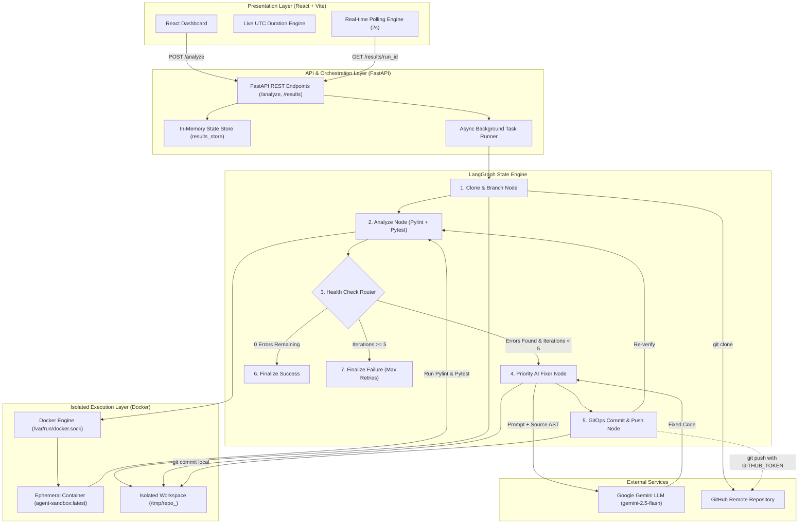
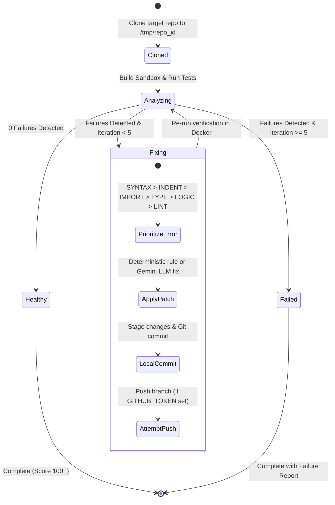

# 🛠️ Autonomous DevOps Agent
> **Self-Healing CI/CD Pipeline & Sandboxed Code Fixer**

An autonomous AI-powered DevOps agent that automatically clones, scans, detects, fixes, and verifies code failures in continuous integration pipelines—reducing developer debugging overhead and accelerating release velocity.

---

## 🏛️ High-Level Design (HLD) Architecture

The system is built on a **Stateful Multi-Agent Architecture** utilizing **LangGraph** for workflow orchestration, **FastAPI** for asynchronous task execution, **Docker** for sandboxed verification, and **Google Gemini** for LLM-driven code repair.



---

## ⚙️ Core Workflow & State Machine



---

## ✨ Key Features

- **Autonomous Closed-Loop Healing**: Iteratively detects failures, generates targeted source patches, applies them to disk, and re-executes tests until all checks pass.
- **Priority-Based Failure Resolution**: Automatically prioritizes critical blocking errors first:
  $$
\text{SYNTAX} \longrightarrow \text{INDENTATION} \longrightarrow \text{IMPORT} \longrightarrow \text{TYPE\_ERROR} \longrightarrow \text{LOGIC} \longrightarrow \text{LINTING}
$$
- **Sandboxed Container Verification**: All linter scans (`pylint`) and unit tests (`pytest`) execute inside isolated, non-root Docker containers—preventing unsafe code execution on host machines.
- **Dual Execution Git Model**:
  - **Authenticated Mode**: If a `GITHUB_TOKEN` is supplied, fixes are pushed directly to a dedicated remote branch on GitHub.
  - **Safe Sandbox Mode**: If pushing to an unauthenticated/public repo, the agent safely executes all fixes in a local isolated workspace without crashing or breaking remote origins.
- **Real-Time Live Telemetry & Scoring**: Live pipeline timeline updates, retry counters, dynamic execution log, and score calculations with speed bonuses ($< 5\text{m}$) and efficiency penalty adjustments.
- **Built-in Benchmark Demo Mode**: Entering `DEMO` as the Team/Leader Name plays an instant, deterministic demonstration run for presentations.

---

## 🧰 Tech Stack

| Layer | Technologies |
| :--- | :--- |
| **Frontend** | React 19, Vite, Tailwind CSS, Heroicons / Lucide Icons |
| **Backend API** | Python 3.11, FastAPI, Uvicorn, Pydantic |
| **Agent Core** | LangGraph, LangChain Core, LangChain Google GenAI |
| **AI Model** | Google Gemini (`gemini-2.5-flash` / `gemini-flash-latest`) |
| **Testing & Linter**| Pytest (JUnit XML reporting), Pylint (JSON telemetry) |
| **Infrastructure** | Docker Engine, GitPython, Python-Dotenv |

---

## 🚀 Installation & Local Setup

### Prerequisites
- **Python 3.10+** (Python 3.11 recommended)
- **Node.js 18+** & `npm`
- **Docker Desktop** (must be running for container verification)
- **Google Gemini API Key** (from [Google AI Studio](https://aistudio.google.com/))

---

### Step 1: Clone Repository & Configure Environment

```bash
git clone https://github.com/Princekumar7999/ci-cd-detecting-agent.git
cd ci-cd-detecting-agent
```

Create and configure your `.env` file in the root directory:

```bash
cp .env.example .env
```

Edit `.env` with your API keys:
```env
# Required for AI Fixer
GOOGLE_API_KEY=your_gemini_api_key_here

# Optional: To push fixes back to your GitHub repository
GITHUB_TOKEN=your_github_personal_access_token_here

# Committer identity
GIT_AUTHOR_NAME="Autonomous DevOps Agent"
GIT_AUTHOR_EMAIL="devops-agent@users.noreply.github.com"

# Frontend backend target
VITE_API_URL=http://localhost:8001
```

---

### Step 2: Start the Backend (FastAPI)

In a new terminal:

```bash
# 1. Create and activate virtual environment
python3 -m venv venv
source venv/bin/activate

# 2. Install dependencies
cd backend
pip install -r requirements.txt

# 3. Start backend on port 8001
uvicorn main:app --reload --port 8001
```
> **Backend API Docs:** `http://localhost:8001/docs`  
> **Health Check:** `http://localhost:8001/status`

---

### Step 3: Start the Frontend (Vite / React)

In a separate terminal:

```bash
cd frontend
npm install
npm run dev
```
> **Frontend Dashboard:** `http://localhost:5173`

---

## 🐳 Running with Docker Compose

To launch both backend and frontend in containerized services:

```bash
docker-compose up --build
```

---

## 📡 REST API Reference

### `POST /analyze`
Triggers an asynchronous agent run for the specified repository.

**Request Body:**
```json
{
  "repo_url": "https://github.com/Princekumar7999/blood_report_test",
  "team_name": "THE_HERO",
  "leader_name": "PRINCE"
}
```

**Response:**
```json
{
  "run_id": "30757722-ce49-493c-95dd-cc8855b2838d",
  "status": "started"
}
```

---

### `GET /results/{run_id}`
Polls current telemetry, pipeline status, applied fixes, and score breakdown.

**Response:**
```json
{
  "status": "completed",
  "iteration": 3,
  "start_time": "2026-08-18T20:03:18.123456+00:00",
  "end_time": "2026-08-18T20:04:45.654321+00:00",
  "lint_errors": [],
  "test_failures": [],
  "fixed_issues": [
    {
      "file": "src/validator.py",
      "bug_type": "SYNTAX",
      "line": 8,
      "commit_message": "Fix SYNTAX in src/validator.py: add colon...",
      "status": "Fixed"
    }
  ],
  "iterations_log": [
    {
      "iteration": 0,
      "status": "FAILED",
      "timestamp": "2026-08-18T20:03:25.000000+00:00",
      "lint_errors_count": 4,
      "test_failures_count": 1
    }
  ]
}
```

---

## 🛡️ Production & Enterprise Deployment

In enterprise CI/CD environments, this agent is deployed as a **GitHub App / Action**:
1. A developer opens a Pull Request or pushes code.
2. If GitHub Actions CI fails, a webhook triggers `/analyze`.
3. The agent receives a scoped installation token, reproduces the failure in an isolated runner, fixes the code, and submits a **Pull Request** back with test verification proofs.
