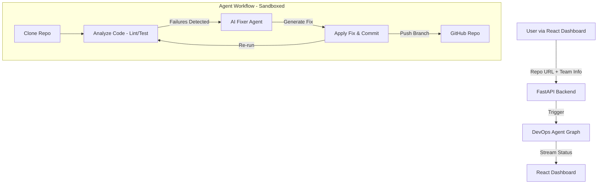

# Autonomous DevOps Agent

An autonomous AI-powered DevOps agent that detects, fixes, and verifies code issues within CI/CD pipelines—reducing manual debugging effort and improving development velocity.

## 🏗 Architecture

The system follows a multi-agent architecture with a React frontend and a Python (FastAPI) backend powered by LangGraph.

Features

Autonomous Issue Resolution
Detects and fixes syntax, linting, import, and logical errors automatically.

Sandboxed Execution
Runs tests securely inside a Docker environment.

Real-Time Monitoring
Live dashboard showing progress, fix status, and execution timeline.

Automated Branch Management
Generates structured branches for fixes (e.g., team_lead_ai_fix).

Hybrid Fixing Strategy
Combines deterministic rules with LLM-based intelligent fixes.

Tech Stack
Frontend
React (Vite)
Tailwind CSS
Lucide Icons

Backend
Python (FastAPI)
LangGraph
LangChain
Google Gemini (LLM)

Tools & Infrastructure
Docker
GitPython
Pylint
Pytest

Installation & Setup
Prerequisites
Python 3.9+
Node.js 18+
Docker (must be running)
Google API Key (for LLM access)

Backend Setup

cd backend
pip install -r requirements.txt
export GOOGLE_API_KEY="your_api_key_here"
uvicorn main:app --reload

Frontend Setup

cd frontend
npm install
npm run dev

Supported Issue Types

The agent can currently detect and fix:

Syntax Errors
Missing colons, indentation issues, invalid syntax.

Linting Issues
Unused imports, formatting problems, missing docstrings.

Import Errors
ModuleNotFoundError, incorrect imports.

Logical Errors
Test failures detected via pytest output.

Type Errors
Basic type mismatches identified by linters.

Known Limitations

Docker Requirement
Docker must be installed and running for sandbox execution.

API Rate Limits
High usage may hit LLM rate limits (retry mechanisms included).

Complex Bugs
Deep architectural or design-level issues may require manual intervention.

Future Improvements

Support for more programming languages
Smarter root-cause analysis for complex failures
Integration with CI platforms (GitHub Actions, GitLab CI)
Enhanced debugging insights and reporting
